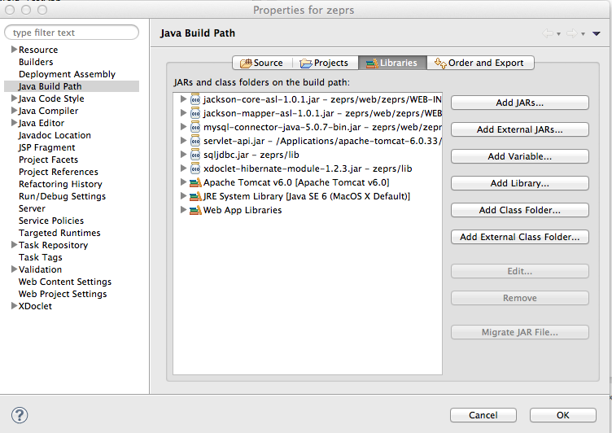
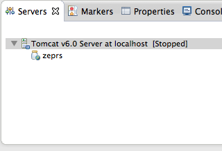
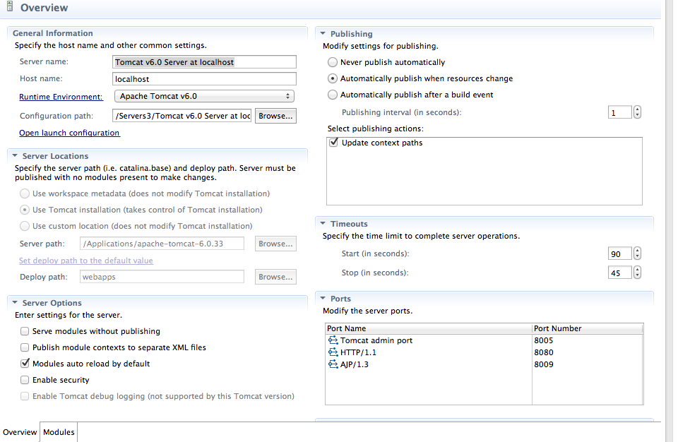
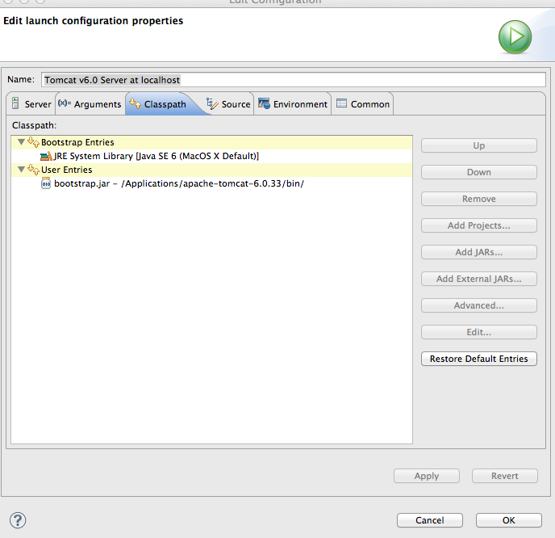
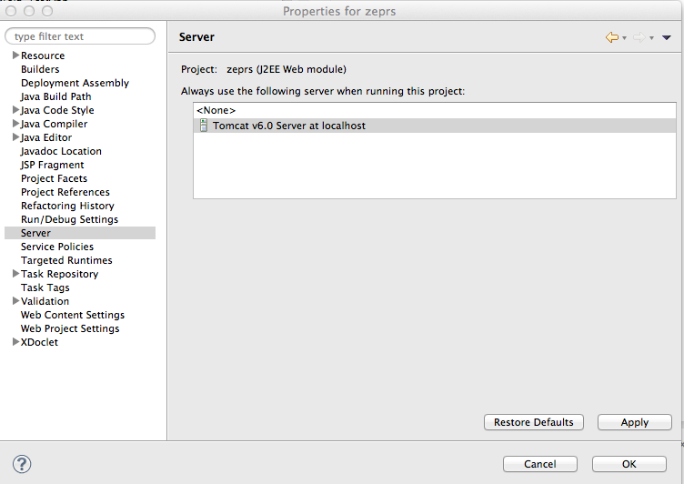
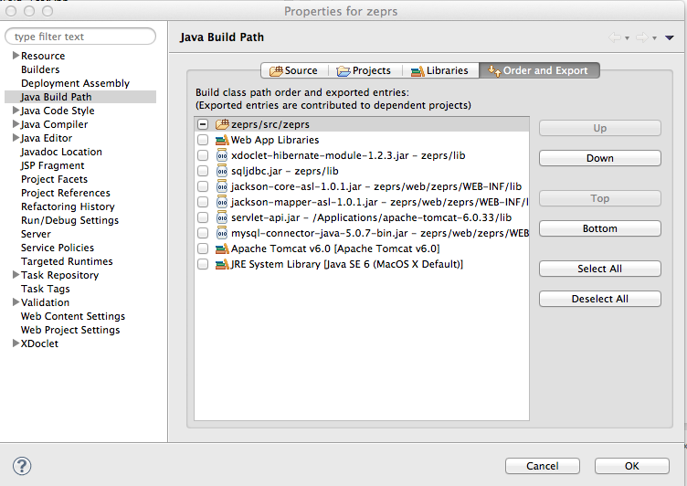

# ZEPRS

The Zambia Electronic Perinatal Record System (ZEPRS) is an Electronic Medical Record (EMR) system 
used by public obstetric clinics and a hospital (the University Teaching Hospital) in Lusaka, Zambia 
to improve patient care. 

The technical requirements are:

* Java 1.6
* MySQL 5
* Apache Tomcat 6

## Configuration

Here are some notes to help a developer get running with ZEPRS. 
Use the versions of the software (jdk, mysql) in the notes.

### JDK

Install jdk 6, not jdk 7
 
### MySQL
 
Instal Mysql: mysql-5.0.96 community edition. Add the following to the bottom of my.ini:

		# zeprs
		old_passwords=1
 
If you are using a newer version of mysql and do not have my.ini, check "old_passwords" in the configurator app.
 
Please note that if you don't have old_passwords set, authentication will not work.

Do not use mysql 5.1; The app does not work properly with it. 

### Apache Tomcat

Install ApacheTomcat 6.0.33

## Source Code

Check out the source code.

Copy the folowing files from zeprs\lib\ to apacheTomcatInstallation\lib
commons-dbcp-1.2.1.jar
commons-logging-1.1.jar
commons-pool-1.3.jar
log4j.properties
tomcat-realm-zeprs.jar

Also copy the mysql-connector-java-5.0.*-bin.jar that came with your mysql installation.  

Do not use mysql-connector-java-5.1.19-bin - this will cause problems with the population of lists.

## Create the Databases

The db installation scripts are in conf/installation.

Using the mysql command, install the zeprs, zeprsdemo, admin, mail, and userdata databases:

		mysql -u root mysql <all-zeprs.sql  
		
Modify the password in db_permissions.sql. 
You will need to replace "password" with the password for zeprs_web_user in META-INF/context.xml.

		mysql -u root mysql <db_permissions.sql

## Eclipse Project Configuration

 - In Eclipse, go to Build Path -> Configure Build Path and add the jars listed in the screenshot below. 
 For Windows, also point to your JDK's tools.jar. This is not necessary for MacOSX - tools.jar is included in its SDK already. 
 
 - Also confirm that the Server Runtime (Tomcat) points to a valid runtime. (Add Library -> Server Runtime.) 
 In the screenshot below, it is already listed as Apache Tomcat 6.
 - Add servlet-api.jar from your tomcat/libs directory. 
 - Confirm that your server runtime is in eclipse preferences -> Server  -> runtime environments
 - In the Servers view, add zeprs to the Tomcat 6 server. 
 
 - check in the projects properties Targgeted runtimes that it is pointed to this server.
  
 - Double-click on the server in Servers view. 
 In the Server Locations section, use tomcat installation and change the deploy path name to webapps. 
 Increase the server timeouts to 90 seconds.
 
 - Click the Modules tab and confirm that the zeprs module is active. If not, use the "Add Web Module" function.
 
 - In Launch configuration arguments tab, put the following at the beginning of the VM arguments:
-Xms256m -Xmx1g -XX:MaxPermSize=256m 
 
 - Set src/zeprs/resources/dev.properties to the path to your source code.
 
### A few more Eclipse screenshots:

 
 
 
 
 

## Ant properties
 
Copy local-example.properties to local.properties and configure the settings if you do anything in ant with build.xml. 
Each time you do a release, run the versions target. 
If you run the javadocs target, you'll need to put the web/zeprs/lib jars in its run classpath.
 
## Testing
 
Use Firefox to test the ZEPRS app; there is a bit of CSS work that must be done to get it to work in Chrome. 
See the README-Tomcat7.md notes if you would like to upgrade ZEPRS to Tomcat 7 and/or Chrome.
 
Point your browser to localhost:8080/zeprs/
Login with zepadmin/zepadmin11

There is a user manual at http://localhost:8080/zeprs/help.do

## More Documentation

More information about ZEPRS is in the [ZEPRS Documentation Book](http://www.ictedge.org/zeprs/book). A snapshot
of that site is at docs/zeprs.html.
The Zcore project proceeded a few years after ZEPRS; the [Zcore docs](http://www.ictedge.org/zdocs) may be useful.

## Misc

If you wish to run any of the ant tasks in build.xml, create a local.properties file. 
There is an example in conf/installation - local-example.properties. Do not check local.properties into github.

If you need to run any batch files using the SQL tool in the ZEPRS web app, 
edit the server address, username, and password in SQLAction.java.
